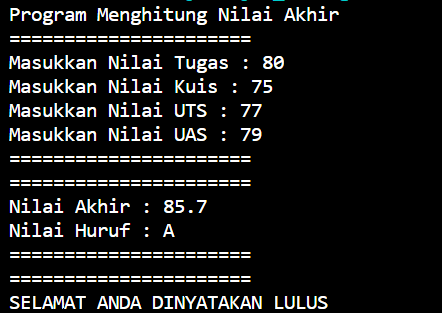
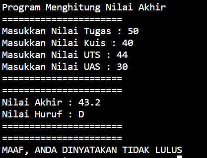
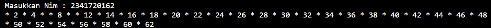
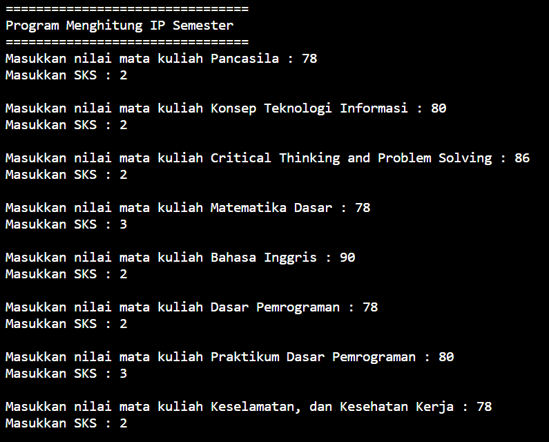
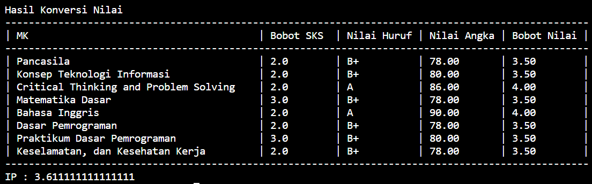
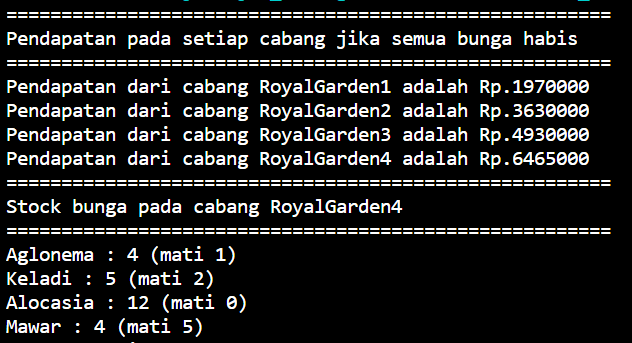
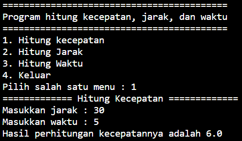
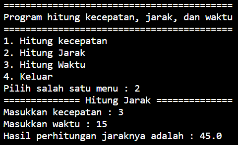
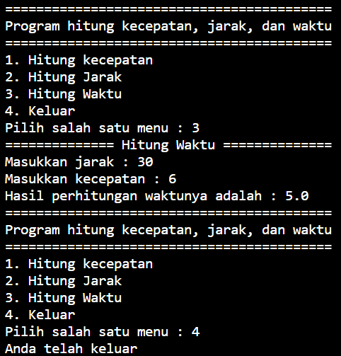

# Laporan Praktikum Pertemuan 1
### Nama : Diana Rahmawati
### No : 08
### NIM : 2341720162
### Kelas : TI - 1H 

## Praktikum 1 (Pemilihan)
### Output jika lulus
 

### Output jika tidak lulus
 

## Praktikum 2 (Perulangan)
 

## Praktikum 3 (Array)
Output menampilkan inputan nilai dan input SKS

Hasil konversi nilai

## Praktikum 4 (Fungsi)
Output menampilkan pendapatan setiap cabang dan stock bunga RoyalGarden4

 

# Tugas
## Nomer 1
Output jika plat yang dicari tersedia

 

Output jika plat yang dicari tidak tersedia

 

## Nomer 2
Output menghitung kecepatan 

Output menghitung jarak 

Output menghitung waktu dan menu keluar 

