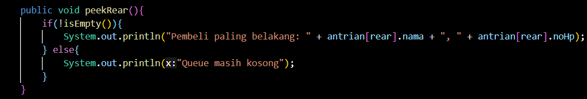
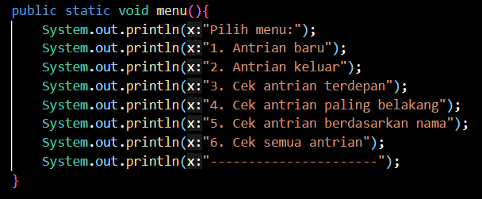

# Laporan Praktikum Pertemuan 11
## Jobsheet 10 - Queue

Nama    : Diana Rahmawati<br>
Kelas   : TI - 1H<br>
NIM     : 2341720162<br>

### 10.2 Praktikum 1
#### 10.2.2 Verifikasi Hasil Percobaan
<br>


#### 10.2.3 Pertanyaan
1. Pada konstruktor, mengapa nilai awal atribut front dan rear bernilai -1, sementara atribut size bernilai 0?<br>
**Jawab:** Karena pada atribut front dan rear menunjukkan index dari data, dimana index pertama dimulai dari 0 dan untuk menampilkan data yang masih kosong dengan -1. Untuk atribut size sendiri menunjukkan jumlah data pada queue jika masih kosong berarti sizenya 0. <br>
2. Pada method Enqueue, jelaskan maksud dan kegunaan dari potongan kode berikut! 
```java 
if (rear == max -1){
    rear = 0;
}
```
**Jawab:**  Potongan kode diatas digunakan untuk melihat apakah pointer rear sudah mencapai batas panjang array, jika sudah mencapai maka pointer rear akan berulang ke index 0. Artinya penambahan data baru akan diulang dari index 0.<br>
3. Pada method Dequeue, jelaskan maksud dan kegunaan dari potongan kode berikut!<br>
```java
    if (front == max -1){
        front = 0;
    }

```
**Jawab:**  Kode diatas digunakan untuk melihat apakah pointer front sudah mencapai batas panjang array, jika sudah mencapai batas maka pointer front akan berulang ke index 0. Artinya pengambilan data akan diulang dari index 0.<br>
4. Pada method print, mengapa pada proses perulangan variabel i tidak dimulai dari 0 (int i=0), melainkan int i=front? <br>
**Jawab:** Karena data yang berada di posisi depan belum tentu pada index ke 0, bisa saja berada pada index belakang karena terjadinya proses enqueue dan dequeue. Maka dari itu untuk menandai data depan menggunakan pointer front, sehingga print dimulai dari front.<br>
5. Perhatikan kembali method print, jelaskan maksud dari potongan kode berikut!
```java
i = (i + 1) % max;
```
**Jawab:** Kode program diatas digunakan untuk melakukan increment untuk variable i, dan akan mereset ke 0 jika i sudah melampaui batas panjang array.<br>
6. Tunjukkan potongan kode program yang merupakan queue overflow!<br>
**Jawab:** 
<br>
7. Pada saat terjadi queue overflow dan queue underflow, program tersebut tetap dapat berjalan dan hanya menampilkan teks informasi Lakukan modifikasi program sehingga pada saat terjadi queue overflow dan queue underflow, program dihentikan!<br>
**Jawab:** 
<br>
<br>


### 10.3 Praktikum 2
#### 10.3.2 Verifikasi Hasil Percobaan
<br>


#### 10.3.3 Pertanyaan
1. Pada class QueueMain, jelaskan fungsi IF pada potongan kode program berikut!
```java
if (!"".equals(data.norek) && !"".equals(data.nama) && !"".equals(data.alamat) && data.umur != 0  && data.saldo != 0){
    System.out.println("Antrian yang keluar" + data.norek + " "+ data.nama + " " + data.alamat + " "+data.umur + " " + data.saldo);
    break;
}
```
**Jawab:** Pada proses dequeue akan mengembalikan 1 return data berupa nasabah, fungsi IF diatas digunakan untuk memastikan bahwa data nasabah yang diambil bukan merupakan data kosong, melainkan data yang sudah diisi.<br>
2. Lakukan modifikasi program dengan menambahkan method baru bernama peekRear pada class Queue yang digunakan untuk mengecek antrian yang berada di posisi belakang! Tambahkan pula daftar menu 5. Cek Antrian paling belakang pada class QueueMain sehingga method peekRear dapat dipanggil!<br>
**Jawab:** 
- Fungsi queue

- Main 
<br>

- Output


### 10.4 Tugas
1. Buatlah program antrian untuk mengilustasikan pesanan disebuah warung. Ketika seorang pembeli akan mengantri, maka dia harus mendaftarkan nama, dan nomor HP seperti yang digambarkan pada Class diagram berikut:
<br>
Class diagram Queue digambarkan sebagai berikut:
<br>
Keterangan:
- Method create(), isEmpty(), isFull(), enqueue(), dequeue() dan print(), kegunaannya sama seperti yang telah dibuat pada Praktikum
- Method peek(): digunakan untuk menampilkan data Pembeli yang berada di posisi antrian paling depan
 <br>
- Method peekRear(): digunakan untuk menampilkan data Pembeli yang berada di posisi antrian paling belakang
 <br>
- Method daftarPembeli(): digunakan untuk menampilkan data seluruh pembeli
 <br>
- Class pembeli
<br>
- Main
<br>
<br>
<br>
- Output
<br>
