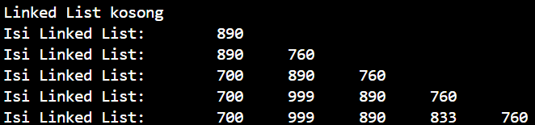
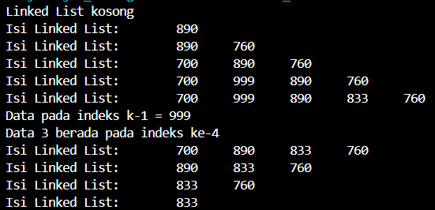
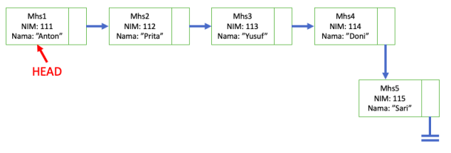
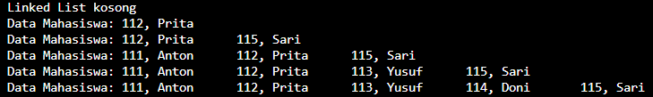
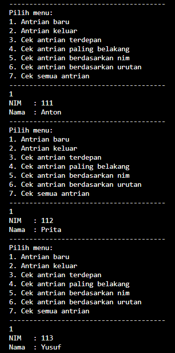
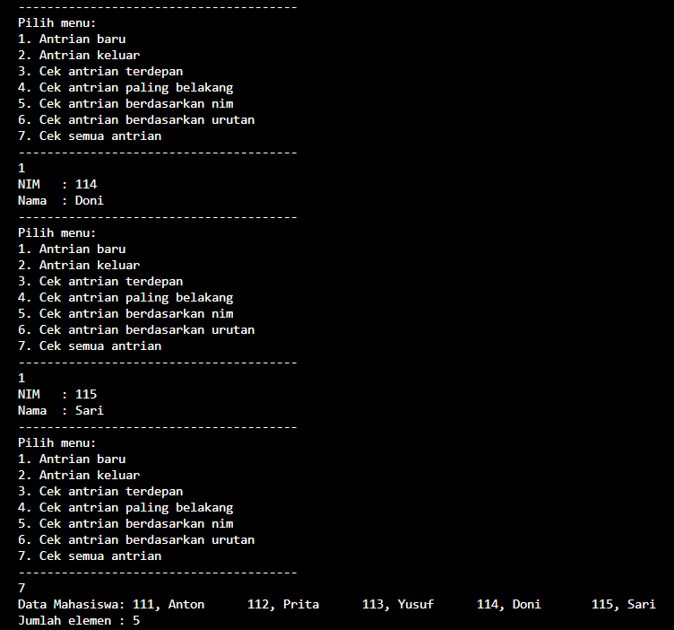
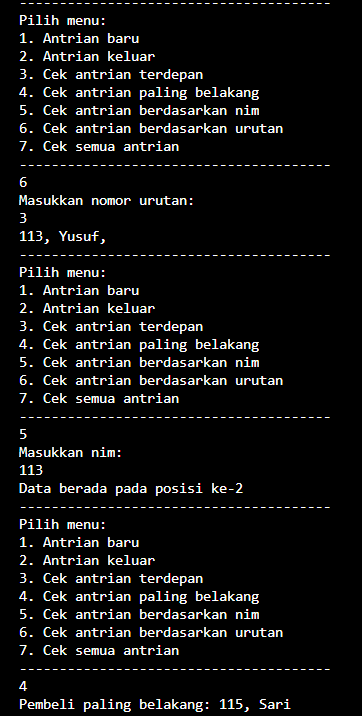
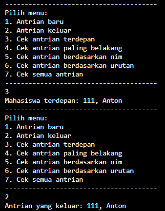

# JOBSHEET PERTEMUAN 11
## LINKED LIST

Nama    : Diana Rahmawati<br>
Kelas   : TI - 1H<br>
NIM     : 2341720162

### 2.1 Pembuatan Single Linked List
#### 2.1.1 Verifikasi Hasil Percobaan


#### 2.1.2 Pertanyaan
1. Mengapa hasil compile kode program di baris pertama menghasilkan “Linked List Kosong”?<br>
**Jawab:** Karena belum ada data yang dimasukkan ke dalam linked list.<br>
2. Jelaskan kegunaan variable temp secara umum pada setiap method!<br>
**Jawab:**  Variabel temp dalam linked list digunakan untuk penanda atau penunjuk saat menjalankan operasi-operasi tertentu seperti penambahan, pencarian atau penghapusan node. <br>
3. Perhatikan class **SingleLinkedList**, pada method **insertAt** Jelaskan kegunaan kode berikut
```java
    if(temp.next == null) tail=temp.next;
```
**Jawab:** Kode tersebut berguna untuk memeriksa apakah node yang dimasukkan merupakan node terakhir dalam linked list. Jika iya maka tail akan diperbarui untuk menunjuk ke node terakhir tersebut. Jadi kode tersebut digunakan untuk memastikan tail agar selalu menunjuk node terakhir dalam linked list.<br>

### 2.2 Modifikasi Elemen pada Single Linked List
#### 2.2.2 Verifikasi Hasil Percobaan


#### 2.2.3 Pertanyaan
1. Mengapa digunakan keyword break pada fungsi remove? Jelaskan!<br>
**Jawab:** Keyword break pada fungsi ini digunakan untuk menghentikan perulangan melalui linked list setelah sebuah node dihapus.
2. Jelaskan kegunaan kode dibawah pada method remove<br>
```java
    else if (temp.next.data == key) {
        temp.next = temp.next.next;
    }
```
**Jawab:** Pada kode else if (temp.next.data == key) digunakan untuk mengecek apakah 1 data didepan dari data yang sekarang adalah data yang dicari. Jika iya, kemudian kode temp.next = temp.next.next; digunakan untuk mengubah next dari data yang sekarang menjadi next dari data yang dicari, sehingga data yang dicari akan terhapus

### 3. Tugas
1. Implementasikan ilustrasi Linked List Berikut. Gunakan 4 macam penambahan data yang telah dipelajari sebelumnya untuk menginputkan data.<br>
<br>
**Jawab:** 
- Output
<br>
2. Buatlah implementasi program antrian layanan unit kemahasiswaan sesuai dengan kondisi yang ditunjukkan pada soal nomor 1! Ketentuan
a. Implementasi antrian menggunakan Queue berbasis Linked List!
b. Program merupakan proyek baru, bukan modifikasi dari soal nomor 1
**Jawab:**
- Output
<br>
<br>
<br>
<br>