# LAPORAN JOBSHEET 10 - DOUBLE LINKED LIST
## Pertemuan 13

Nama    : Diana Rahmawati <br>
NIM     : 2341720162<br>
Kelas   : TI - 1H

### 12.2 Kegiatan Praktikum 1
#### 12.2.2 Verifikasi Hasil Percobaan
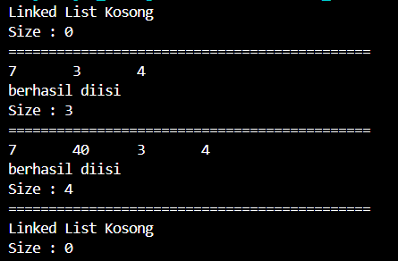<br>

#### 12.2.3 Pertanyaan Percobaan
1. Jelaskan perbedaan antara single linked list dengan double linked lists!<br>
**Jawab:** Single Linked List hanya memilki 1 pointer yaitu next, sedangkan Double Linked LIst memilki 2 pointer yaitu prev dan next. <br>
2. Perhatikan class Node, di dalamnya terdapat atribut next dan prev. Untuk apakah atribut tersebut? <br>
**Jawab:** Atribut next digunakan untuk menunjuk node berikutnya dalam linked list, sedangkan atribut prev digunakan iuntuk menunjuk node sebelumnya dalam linked list<br>
3. Perhatikan konstruktor pada class DoubleLinkedLists. Apa kegunaan inisialisasi atribut head dan size seperti pada gambar berikut ini?
```java
    public DoubleLinkedList(){
        head = null;
        size = 0;
    }
```
**Jawab:** Inisialisasi atribut head digunakan untuk menunjukkan bahwa linked list tidak terisi node apapun, sehingga head diatur sebagai null. Sedangkan inisialisasi atribut size digunakan untuk menunjukkan bahwa linked list tidak memiliki elemen apapun, sehingga diatur menjadi 0.
Dengan kata lain inisialisasi atribut head dan size ini digunakan untuk menunjukkan bahwa linked list masih kosong.<br>
4. Pada method addFirst(), kenapa dalam pembuatan object dari konstruktor class Node prev dianggap sama dengan null?
```java
    Node newNode = new Node(null, item, head);
```
**Jawab:** Karena ketika menambahkan node baru di awal, maka node tersebut akan menjadi node pertama dan tidak memilki node sebelumnya. Sehingga atribut prev diatur sebagai null.<br>
5. Perhatikan pada method addFirst(). Apakah arti statement head.prev = newNode ? <br>
**Jawab:** Digunakan untuk membuat node baru sebelum dari head yang sekarang, kemudian data baru tersebut menjadi head yang baru
6. Perhatikan isi method addLast(), apa arti dari pembuatan object Node dengan mengisikan parameter prev dengan current, dan next dengan null?
```java
    Node newNode = new Node(current, item, null);
```
**Jawab:** Pembuatan Object tersebut berarti bahwa node baru yang ditambahkan akan menjadi node terakhir di linked list. Parameter prev yang diganti dengan current menunjuk ke node terakhir sebelumnya. dan next diisi dengan null menunjukkan bahwa ini adalah node terakhir.<br>
7. Pada method add(), terdapat potongan kode program sebagai berikut

jelaskan maksud dari bagian yang ditandai dengan kotak kuning.<br>
**Jawab:** Maksud dari kode program tersebut digunakan untuk menambah node di awal linked list. Pada pemilihan if dengan kondisi (current.prev == null) jika current adalah head, maka node baru akan dibuat dengan prev = null, kemudian menjadikan current.prev ke node baru dan yang terakhir mengupdate head ke node baru.

### 12.3 Kegiatan Praktikum 2
#### 12.3.2 Verifikasi Hasil Percobaan
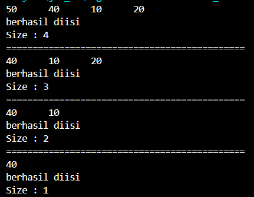<br>

#### 12.3.3 Pertanyaan Percobaan
1. Apakah maksud statement berikut pada method **removeFirst()**?<br>
```java 
    head = head.next;
    head.prev = null;
```
**Jawab:** Statement diatas digunakan untuk mengubah head yang sekarang menjadi head yang selanjutnya, sehingga head yang sekarang akan hilang.<br>
2. Bagaimana cara mendeteksi posisi data ada pada bagian akhir pada method **removeLast()**?<br>
**Jawab:** Posisi data pada bagian akhir dideteksi dengan menggunakan perulangan while untuk menelusuri linked list sampai ke node terakhir.<br>
3. Jelaskan alasan potongan kode program di bawah ini tidak cocok untuk perintah remove!
```java
    Node tmp = head.next;

    head.next = tmp.next;
    tmp.next.prev = head;
```
**Jawab:** Kode program tersebut tidak cocok untuk perintah remove dikarenakan kode tersbut mencoba untuk menghapus node dari linked list tanpa memeriksa node yang akan dihapus, apakah node yang dihapus adalah node pertama atau bukan. Hal ini dapat menyebabkan kehilangan referensi ke node yang dihapus.<br>
4. Jelaskan fungsi kode program berikut ini pada fungsi remove!
```java
    current.prev.next = current.next;
    current.next.prev = current.prev;
```
**Jawab:** Kode program tersebut berfungsi untuk mengatur pointer next dari node yang sebelumnya menjadi next setelah node yang akan dihapus. Dan mengatur menggati prev dari node setelahnya menjadi prev sebelum node yang akan dihapus, Sehingga node yang sekarang terhapus.

### 12.4 Kegiatan Praktikum 3
#### 12.4.2 Verifikasi Hasil Percobaan
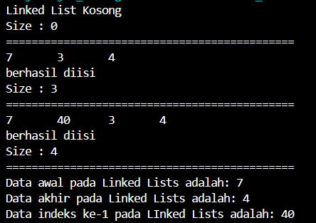<br>

#### 12.4.3 Pertanyaan Percobaan
1. Jelaskan method **size()** pada class DoubleLinkedLists!<br>
**Jawab:** Method ini digunakan untuk mereturn ukuran/jumlah dari elemen linked list.
2. Jelaskan cara mengatur indeks pada double linked lists supaya dapat dimulai dari indeks ke-1!<br>
**Jawab:** Dengan cara mengganti size = 0 menjadi size = 1;
3. Jelaskan perbedaan karakteristik fungsi **Add** pada Double Linked Lists dan Single Linked Lists!<br>
**Jawab:** Jika pada single linked list hanya bisa mengirimkan parameter data dan next node saja sedangkan pada double linked list mengirimkan data beserta node next dan prev nya.
4. Jelaskan perbedaan logika dari kedua kode program di bawah ini!<br> 
**Jawab:** Pada kode program (a) method ini memeriksa nilai atribut dari size jika size adalah 0 berarti size tidak memiliki elemen apapun sehingga mengembalikan nilai true dan jika size lebih dari 0 berarti terdapat beberapa elemen dalam size sehingga mengembalikan nilai false.
Sedangkan pada kode program (b) method ini memeriksa apakah head bernilai null, jika iya maka mengembalikan nilai true dan jika tidak akan mengembalikan nilai false. 

### 12.5 Tugas Praktikum
1. Buat program antrian vaksinasi menggunakan queue berbasis double linked list sesuai ilustrasi dan menu di bawah ini! **(counter jumlah antrian tersisa di menu cetak(3) dan data orang yang telah divaksinasi di menu Hapus Data(2) harus ada) Contoh Ilustrasi Program**
Menu Awal dan Penambahan Data<br>
Cetak Data **(Komponen di area merah harus ada)**<br>
Hapus Data **(Komponen di area merah harus ada)**<br>
**Jawab:** 
- Output : <br>
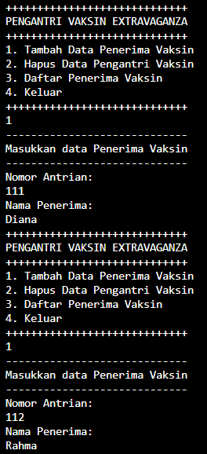 <br>
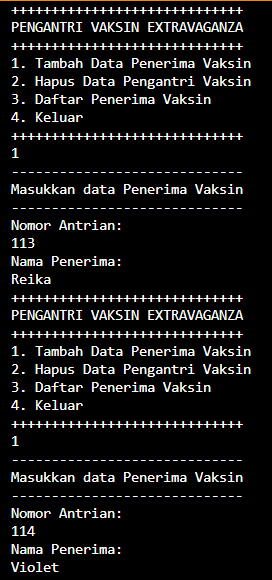 <br>
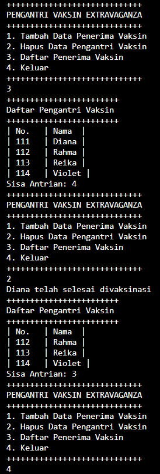 <br>

2. Buatlah program daftar film yang terdiri dari id, judul dan rating menggunakan double linked lists, bentuk program memiliki fitur pencarian melalui ID Film dan pengurutan Rating secara descending. Class Film wajib diimplementasikan dalam soal ini. 
**Contoh Ilustrasi Program**
Menu Awal dan Penambahan Data<br>
Cetak Data<br>
Pencarian Data<br>
**Jawab:**
- Output
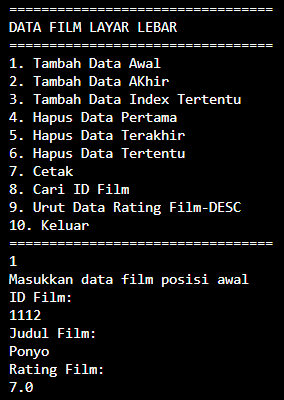<br>
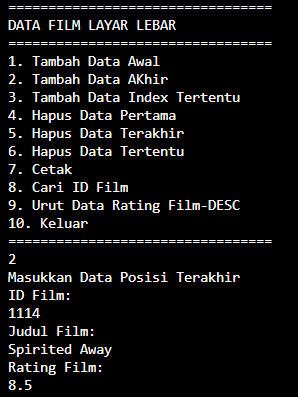<br>
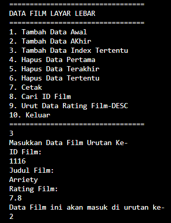<br>
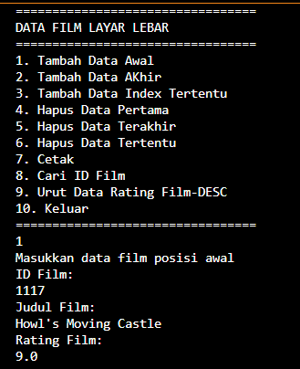<br>
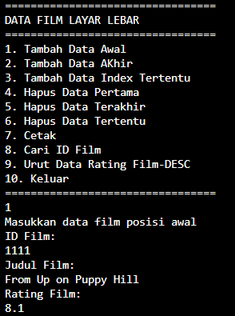<br>
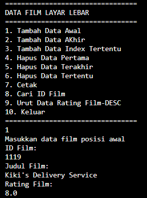<br>
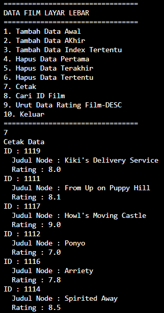<br>
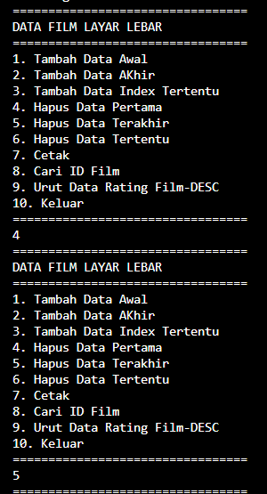<br>
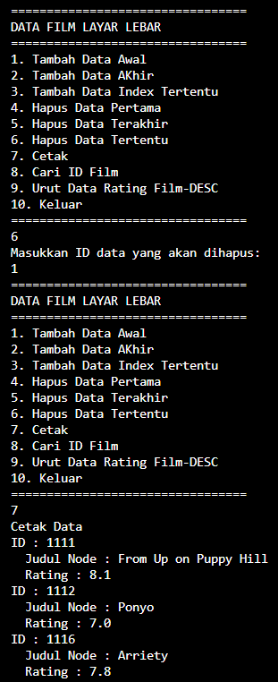<br>
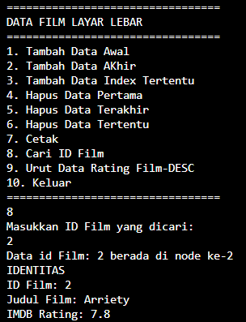<br>
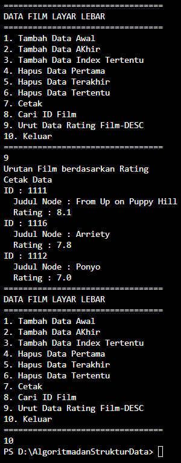


