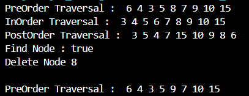
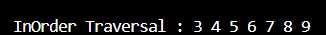
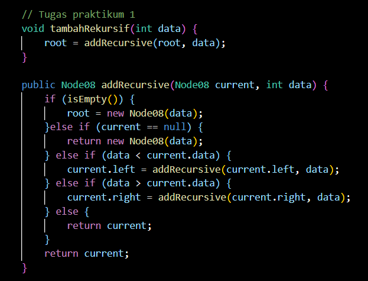
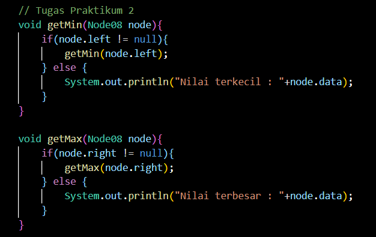
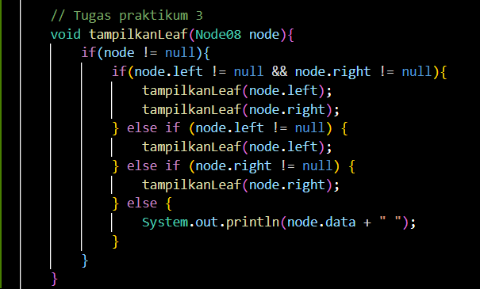
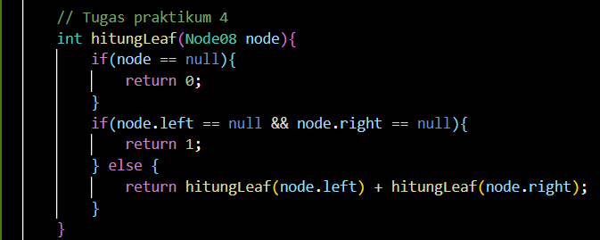
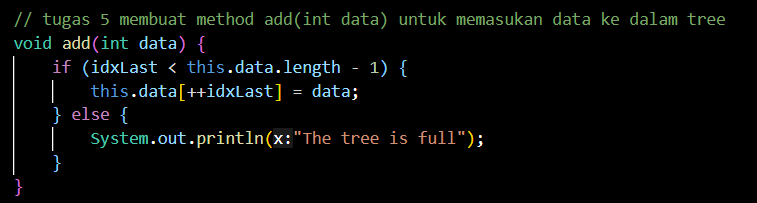
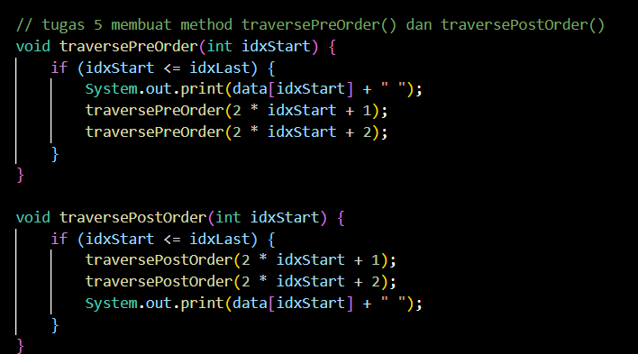

# JOBSHEET 13 - TREE
## PERTEMUAN 14

Nama : Diana Rahmawati<br>
NIM : 2341720162 <br>
Kelas : TI - 1H

### 13.2 Kegiatan Praktikum 1 - Implementasi Binary Search Tree menggunakan Linked List
<br>

#### 13.2.2 Pertanyaan Percobaan
1. Mengapa dalam binary search tree proses pencarian data bisa lebih efektif dilakukan dibanding binary tree biasa?<br>
**Jawab:** Karena Binary Search Tree lebih terstruktur daripada Binary Tree. Dimana Binary Search Tree mengeliminasi setengah node, jadi pencarian dilakakukan pada setengah dari node yang tersisa. <br>
2. Untuk apakah di class **Node**, kegunaan dari atribut **left** dan **right**?<br>
**Jawab:** Attribut left digunakan untuk menyimpan node sebelah kiri dari node saat ini dan Attribut right digunakan untuk menyimpan node sebelah kanan dari node saat ini<br>
3.  a. Untuk apakah kegunaan dari atribut root di dalam class **BinaryTree**?<br>
    **Jawab:** Attribut root digunakan untuk mengetahui node teratas dari sebuah Binary Tree.<br>
    b. Ketika objek tree pertama kali dibuat, apakah nilai dari **root**?<br>
    **Jawab:** Nilai dari root saat pertama kali dibuat adalah null.<br>
4. Ketika tree masih kosong, dan akan ditambahkan sebuah node baru, proses apa yang akan terjadi?<br>
**Jawab:** Maka yang terjadi adalah node tersebut akan ditambahkan sebagai root.<br>
5. Perhatikan method **add()**, di dalamnya terdapat baris program seperti di bawah ini. Jelaskan secara detil untuk apa baris program tersebut?
```java 
if(data<current.data){
    if(current.left!=null){
        current = current.left;
    }else{
        current.left = new Node(data);
    break;
    }
}
```
**Jawab:** Pada pemilihan pertama digunakan untuk mengecek apakah data baru tersebut lebih kecil dari current node. Sedangkan pada pemilihan kedua digunakan untuk mengecek apakah left child dari current node kosong, jika iya maka current akan diubah menjadi current.left dan perulangan dilanjutkan. Dan jika tidak maka node baru akan ditambahkan dan dijadikan sebagai current.left perulangan pun berhenti.<br>


### 13.3 Kegiatan Praktikum 2 - Implementasi binary tree dengan array
<br>

#### 13.3.2 Pertanyaan Percobaan
1. Apakah kegunaan dari atribut data dan idxLast yang ada di class **BinaryTreeArray**?<br>
**Jawab:** Atribut data digunakan untuk menyimpan elemen array data sedangkan atribut idxLast digunakan untuk menyimpan index elemen terakhir atau node terakhir di dalam array.<br>
2. Apakah kegunaan dari method **populateData()**?<br>
**Jawab:** Method ini digunakan untuk mengisi data ke dalam atribut data dan index last. <br>
3. Apakah kegunaan dari method **traverseInOrder()**?<br>
**Jawab:** Method ini digunakan untuk mengunjungi setiap data yang ada pada BinaryTreeArray dengan urutan traversal in-order.<br>
4. Jika suatu node binary tree disimpan dalam array indeks 2, maka di indeks berapakah posisi left child dan rigth child masing-masing?<br>
**Jawab:** Left child akan berada pada index ke-5 sedangkan right child akan berada pada index ke-6.<br>
5. Apa kegunaan statement int idxLast = 6 pada praktikum 2 percobaan nomor 4?<br>
**Jawab:** Statement tersebut digunakan untuk menentukan batas index terakhir yang valid pada array data. Dengan mengatur idxLast = 6, menjadikan hanya elemen-elemen dari index 0 - 6 yang akan di traversal.

### 13.4 Tugas Praktikum
1. Buat method di dalam class BinaryTree yang akan menambahkan node dengan cara rekursif.<br>
**Jawab:**
<br>
2. Buat method di dalam class BinaryTree untuk menampilkan nilai paling kecil dan yang paling besar yang ada di dalam tree.<br>
**Jawab:**
<br>
3. Buat method di dalam class BinaryTree untuk menampilkan data yang ada di leaf.<br>
**Jawab:**
<br>
4. Buat method di dalam class BinaryTree untuk menampilkan berapa jumlah leaf yang ada di dalam tree.<br>
**Jawab:**
<br>
5. Modifikasi class BinaryTreeArray, dan tambahkan : <br>
- method add(int data) untuk memasukan data ke dalam tree<br> 
<br>

- method traversePreOrder() dan traversePostOrder()<br>
<br>
