# PERTEMUAN 15 
## JOBSHEET 12 - GRAPH

Nama : Diana Rahmawati 
NIM : 2341720162 
Kelas : TI - 1H

### 2.1 Percobaan 1: Implementasi Graph menggunakan Linked List
#### 2.1.2 Verifikasi Hasil Percobaan
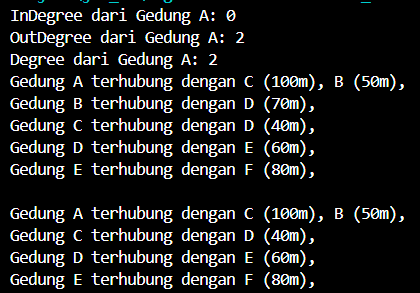

#### 2.1.3 Pertanyaan
1. Perbaiki kode program Anda apabila terdapat error atau hasil kompilasi kode tidak sesuai! 
**Jawab:** 

2. Pada class Graph, terdapat atribut list[] bertipe DoubleLinkedList. Sebutkan tujuan pembuatan variabel tersebut! 
**Jawab:** Tujuan dari variabel tersebut digunakan untuk merepresentasikan kumpulan node yang terhubung dalam graph. Menggunakan tipe data DoubleLinkedList yang memungkinkan untuk menyimpan data antara node.  
3. Jelaskan alur kerja dari method removeEdge! 
**Jawab:** Pertama method ini menerima 2 parameter asal dan tujuan yang merupakan index node dari sambungan yang akan dihapus, kemudian dilakukan perulangan for melalui semua node dalam graph sebanyak vertex. Selanjutnya pada setiap perulangan apakah index node saat ini sama dengan tujuan, jika iya node tersebut akan dihapus menggunakan remove(int index) dari DoubleLinkedList pada daftar sambungan asal. Setelah node selesai dihapus dari daftar sambungan asal, perulangan akan berlanjut hingga selesai. 
4. Apakah alasan pemanggilan method addFirst() untuk menambahkan data, bukan method add jenis lain saat digunakan pada method addEdge pada class Graph? 
**Jawab:** Alasannya yaitu karena method addFirst paling mudah dijalankan tidak perlu menambah index seperti jika menggunakan method add yang membutuhkan parameter.  
5. Modifikasi kode program sehingga dapat dilakukan pengecekan apakah terdapat jalur antara suatu node dengan node lainnya, seperti contoh berikut (Anda dapat memanfaatkan Scanner). 
**Jawab:** 
- 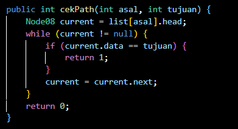 
- 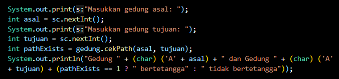 
- 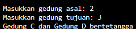 
- 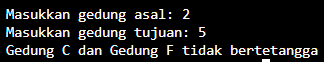 

### 2.2 Percobaan 2: Implementasi Graph menggunakan Matriks
#### 2.2.2 Verifikasi Hasil Percobaan
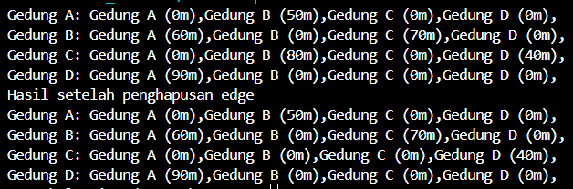

#### 2.2.3 Pertanyaan
1. Perbaiki kode program Anda apabila terdapat error atau hasil kompilasi kode tidak sesuai! 
**Jawab:**

2. Apa jenis graph yang digunakan pada Percobaan 2? 
**Jawab:** Termasuk ke dalam jenis directed graph
3. Apa maksud dari dua baris kode berikut? 
**Jawab:** Kode tersebut digunakan untuk memperbarui matriks dalam objek gdg sesuai sambungan baru yang ditentukan oleh setiap panggilan method makeEdge. Jadi graf tersebut menggambarkan 2 jalur satu antara 2 gedung dengan bobot yang berbeda.  
4. Modifikasi kode program sehingga terdapat method untuk menghitung degree, termasuk inDegree dan outDegree! 
**Jawab:** 
- 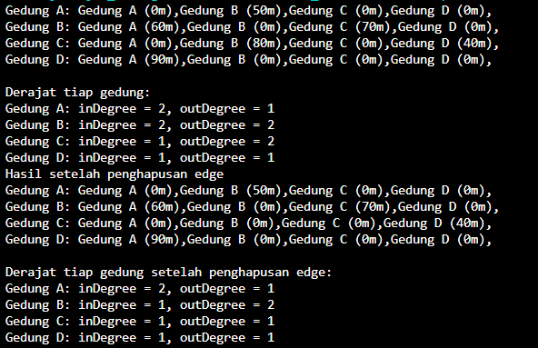

### Latihan Praktikum
1. Modifikasi kode program pada class GraphMain sehingga terdapat menu program yang bersifat dinamis, setidaknya terdiri dari: 
a. Add Edge
b. Remove Edge
c. Degree
d. Print Graph
e. Cek Edge
Pengguna dapat memilih menu program melalui input Scanner 
**Jawab:** 
- 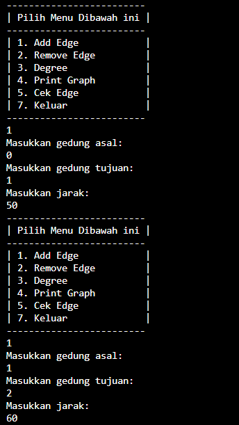 
- 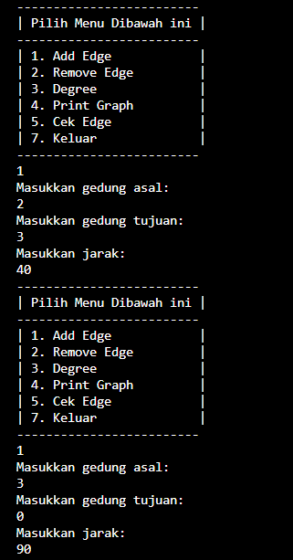 
- 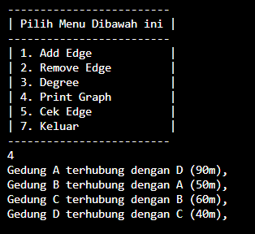 
- 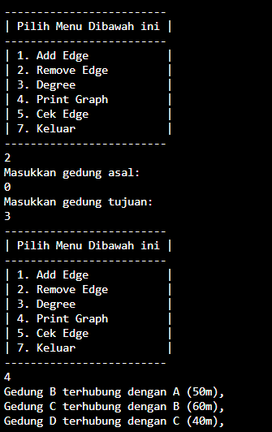 
- 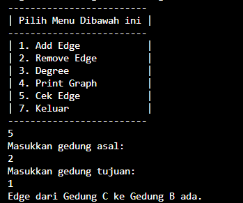 
2. Tambahkan method updateJarak pada Percobaan 1 yang digunakan untuk mengubah jarak antara dua node asal dan tujuan! 
**Jawab:**
- 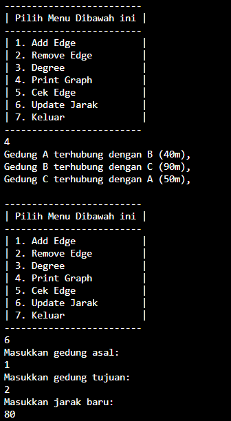 
- 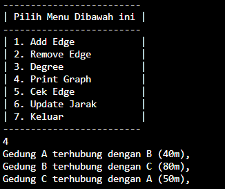 
3. Tambahkan method hitungEdge untuk menghitung banyaknya edge yang terdapat di dalam graf! 
**Jawab:**
- 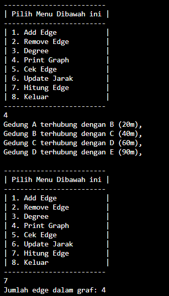 

