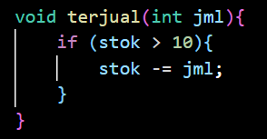
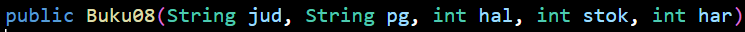
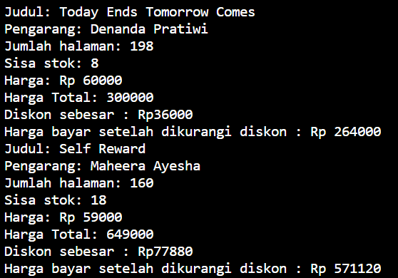
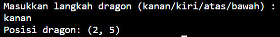

# Praktikum Pertemuan 2 (Object)
Nama : Diana Rahmawati

NIM : 2341720162

Kelas : TI - 1H

## 2.1 Percobaan 1: Deklarasi Class, Atribut dan Method

### 2.1.3 Pertanyaan
1. Sebutkan dua karakteristik class atau object!

    **Jawab** : Karakteristik dari class/object yaitu memililki atribut dan behavior/method.

2. Perhatikan class Buku pada Praktikum 1 tersebut, ada berapa atribut yang dimiliki oleh class 
Buku? Sebutkan apa saja atributnya!

    **Jawab** : Terdapat 5 atribut di dalam class Buku08 yaitu :
    * String judul
    * String pengarang 
    * Int halaman
    * Int stok
    * Int harga 

3. Ada berapa method yang dimiliki oleh class tersebut? Sebutkan apa saja methodnya!

    **Jawab** : Terdapat 4 method yaitu :
    * tampilInformasi() 
    * terjual(),
    * restock()
    * gantiHarga()

4. Perhatikan method terjual() yang terdapat di dalam class Buku. Modifikasi isi method tersebut 
sehingga proses pengurangan hanya dapat dilakukan jika stok masih ada (lebih besar dari 0)! 

    **Jawab** : 

5. Menurut Anda, mengapa method restock() mempunyai satu parameter berupa bilangan int?

    **Jawab** : Karena method ini menangkap data dari user yang dikirim melalui parameter jadi di dalam parameter terdapat variabel jml dengan tipe data int. Menggunakan tipe data int karena nilai dari variabel stok berupa bilangan bulat. 

## 2.2 Percobaan 2: Instansiasi Object, serta Mengakses Atribut dan Method

### 2.2.3 Pertanyaan
1. Pada class BukuMain, tunjukkan baris kode program yang digunakan untuk proses instansiasi!
Apa nama object yang dihasilkan?

    **Jawab** : Baris kode program instansiasinya yaitu : Buku08 bk1 = new Buku08(); dan nama object yang dihasilkan yaitu bk1.

2. Bagaimana cara mengakses atribut dan method dari suatu objek?

    **Jawab** : Dengan memanggil nama object.nama atribut/nama object, contohnya bk1.judul atau bk1.tampilInformasi().

3. Mengapa hasil output pemanggilan method tampilInformasi() pertama dan kedua berbeda?

    **Jawab** : Karena terdapat perubahan nilai atribut bk1 setelah pemanggilan method terjual() dan gantiHarga().

## 2.3 Percobaan 3: Membuat Konstruktor

    

### 2.3.3 Pertanyaan 
1. Pada class Buku di Percobaan 3, tunjukkan baris kode program yang digunakan untuk 
mendeklarasikan konstruktor berparameter!

    **Jawab** : Berikut adalah kode program dari deklarasi konstruktor berparameter

2. Perhatikan class BukuMain. Apa sebenarnya yang dilakukan pada baris program berikut?

    **Jawab** : Untuk mengisi/menginisialisasikan nilai dari konstruktor berparameter

3. Hapus konstruktor default pada class Buku, kemudian compile dan run program. Bagaimana 
hasilnya? Jelaskan mengapa hasilnya demikian! 

    **Jawab** : Terjadi error saat konstruktor default dihapus karena compiler tidak dapat menemukan konstruktor yang cocok untuk membuat objek.

4. Setelah melakukan instansiasi object, apakah method di dalam class Buku harus diakses 
secara berurutan? Jelaskan alasannya!

    **Jawab** : Tidak, method di dalam class buku tidak harus diakses secara berurutan karena tidak akan memengaruhi hasil dari method namun akan memengaruhi hasil outputya.

5. Buat object baru dengan nama buku<NamaMahasiswa> menggunakan konstruktor 
berparameter dari class Buku!

    **Jawab** : 

## 2.4 Latihan Praktikum
1. Pada class Buku yang telah dibuat, tambahkan tiga method yaitu hitungHargaTotal(), 
hitungDiskon(), dan hitungHargaBayar().

    **Jawab** : 

2. Buat program berdasarkan class Dragon

    **Jawab** : 

