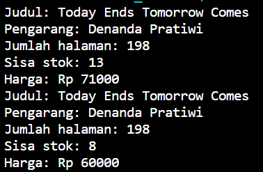
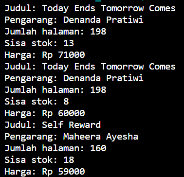
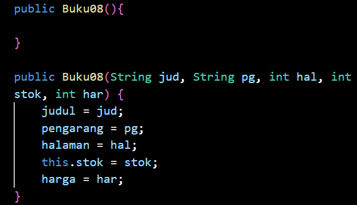
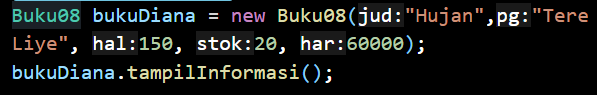

# Praktikum Pertemuan 2 (Object)

## 2.1 Percobaan 1: Deklarasi Class, Atribut dan Method

### 2.1.3 Pertanyaan
1. Karakteristik dari class ... sedangkan karakteristik dari objek ...
2. Terdapat 5 atribut di dalam class Buku08 yaitu judul dan pengarang dengan tipe data String dan halaman, stok, harga dengan tipe data int.
3. Terdapat 4 method yaitu tampilInformasi(), terjual(), restock(), dan gantiHarga().
4. 
5. 

## 2.2 Percobaan 2: Instansiasi Object, serta Mengakses Atribut dan Method

### 2.2.3 Pertanyaan
1. Baris kode program instansiasinya yaitu : Buku08 bk1 = new Buku08(); dan nama object yang dihasilkan yaitu bk1.
2. Dengan memanggil nama object.nama atribut/nama object, contohnya bk1.judul atau bk1.tampilInformasi()
3. Karena terdapat perubahan harga di atribut harga dan method gantiHarga

## 2.3 Percobaan 3: Membuat Konstruktor

### 2.3.3 Pertanyaan 
1. Berikut adalah kode program dari deklarasi konstruktor berparameter

2. Untuk mengisi nilai dari konstruktor berparameter
3. Terjadi error saat konstruktor default dihapus.

4. 

5. 

## 2.4 Latihan Praktikum
1. 

