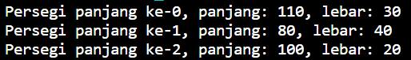
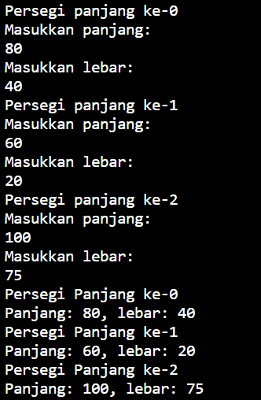
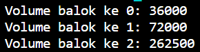

# Laporan Pertemuan 3 (Array of Object)

Nama : Diana Rahmawati

NIM : 2341720162

Kelas : TI - 1H

## 3.2 Percobaan 1: Membuat Array dari Object, Mengisi dan Menampilkan.

### 3.2.3 Pertanyaan
1. Berdasarkan uji coba 3.2, apakah class yang akan dibuat array of object harus selalu memiliki 
atribut dan sekaligus method?Jelaskan!

    **Jawab**: Tidak, sebuah class yang akan dibuat array of object tidak harus memilki method namun harus memiliki atribut. Seperti pada kode program percobaan 1 dimana didalam class hanya atribut tanpa method apapun.

2. Apakah class PersegiPanjang memiliki konstruktor?Jika tidak, kenapa dilakukan pemanggilan 
konstruktur pada baris program berikut :

    **Jawab:** Class PersegiPanjang tidak memiliki konstruktor. Ketika dilakukan instansiasi objek maka akan memanggil konstruktor default yang tidak memilki parameter. 

3. Apa yang dimaksud dengan kode berikut ini:

    **Jawab:** Kode tersebut merupakan pendeklarasian array PersegiPanjang dengan nama ppArray yang dapat menampung 3 buah elemen/objek PersegiPanjang

4. Apa yang dimaksud dengan kode berikut ini:

    **Jawab:** Kode tersebut adalah instansiasi dari objek PersegiPanjang yang akan disimpan dalam ppArray index. Objek tersebut mendefinisikan atribut panjang dan lebar dimana panjangnya 80 dan lebarnya 40;

5. Mengapa class main dan juga class PersegiPanjang dipisahkan pada uji coba 3.2?

    **Jawab**: Karena pada saat dijadikan satu maka akan terjadi error

## 3.3 Percobaan 2: Menerima Input Isian Array Menggunakan Looping.

### 3.3.3 Pertanyaan 

1. Apakah array of object dapat diimplementasikan pada array 2 Dimensi?

    **Jawab:** Iya, bisa

2. Jika jawaban soal no satu iya, berikan contohnya! Jika tidak, jelaskan!

    **Jawab:** Contohnya adalah pengelompokan dosen berdasarkan ruangan, artinya array dimensi 1 merupakan jumlah ruang dosen, kemudian array dimensi 2 merupakan jumlah dosen pada setiap ruang.
    Dosen[][] arrayDosen = new Dosen[7][30];

3. Jika diketahui terdapat class Persegi yang memiliki atribut sisi bertipe integer, maka kode 
dibawah ini akan memunculkan error saat dijalankan. Mengapa?

    **Jawab:** Karena tidak ada instansiasi objek Persegi pada indeks ke-5

4. Modifikasi kode program pada praktikum 3.3 agar length array menjadi inputan dengan Scanner!

    **Jawab:** 

5. Apakah boleh Jika terjadi duplikasi instansiasi array of objek, misalkan saja instansiasi dilakukan 
pada ppArray[i] sekaligus ppArray[0]?Jelaskan !

    **Jawab:** Boleh saja terjadi duplikasi instansiasi objek, karena setiap objek yang diinstansiasi akan
merepresentasikan dirinya masing-masing.

## 3.4 Percobaan 3: Penambahan Operasi Matematika di Dalam Method 

### 3.4.3 Pertanyaan

1. Dapatkah konstruktor berjumlah lebih dalam satu kelas? Jelaskan dengan contoh

    **Jawab:** Iya bisa, sebuah class bisa memiliki lebih dari 1 konstuktor dan instansiasi objek akan menjalankan konstruktor dengan parameter yang sesuai dengan jumlah dan tipe datanya. 

2. Jika diketahui terdapat class Segitiga seperti berikut ini:
Tambahkan konstruktor pada class Segitiga tersebut yang berisi parameter int a, int t
yang masing-masing digunakan untuk mengisikan atribut alas dan tinggi

    **Jawab:**

3. Tambahkan method hitungLuas() dan hitungKeliling() pada class Segitiga
tersebut. Asumsi segitiga adalah segitiga siku-siku. (Hint: Anda dapat menggunakan bantuan 
library Math pada Java untuk mengkalkulasi sisi miring)

    **Jawab:**

4. Pada fungsi main, buat array Segitiga sgArray yang berisi 4 elemen, isikan masing-masing 
atributnya sebagai berikut:
sgArray ke-0 alas: 10, tinggi: 4
sgArray ke-1 alas: 20, tinggi: 10
sgArray ke-2 alas: 15, tinggi: 6
sgArray ke-3 alas: 25, tinggi: 10

    **Jawab:**

5. Kemudian menggunakan looping, cetak luas dan keliling dengan cara memanggil method 
hitungLuas() dan hitungKeliling().

    **Jawab:**

## 3.5 Latihan Praktikum

1. 

2. 

3. 

