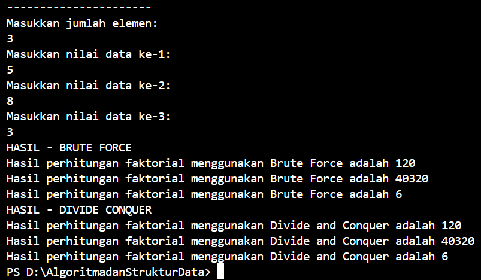
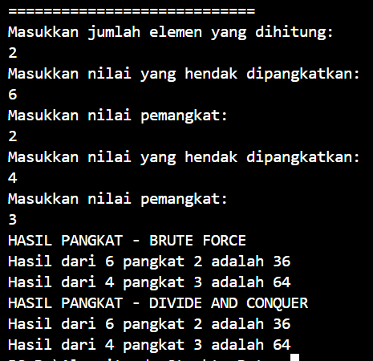

# Laporan Pertemuan 5 (Brute Force dan Divide Conquer)
Nama    : Diana Rahmawati
NIM     : 2341720162
Kelas   : TI - 1H

### 4.2 Menghitung Nilai Faktorial dengan Algoritma Brute Force dan Divide and Conquer


#### 4.2.3 Pertanyaan
1. Pada base line Algoritma Divide Conquer untuk melakukan pencarian nilai faktorial, jelaskan 
perbedaan bagian kode pada penggunaan if dan else!

    **Jawab:** Kondisi if memeriksa kondisi awal apakah n sama dengan 1, jika iya maka akan mengembalikan nilai 1 karena 1 adalah faktorial dari 1.
    Kondisi else digunakan ketika n tidak sama dengan 1, yang kemudian akan menghitung nilai faktorial dengan mengalikan n dengan fungsi faktorialDC(n - 1).
    Perbedaan bagian kode ini yaitu pada kondisi if langsung mengembalikan nilai 1, sedangkan pada kondisi else akan menghitung perkalian nilai n dengan hasil rekursif dari faktorialDC(n - 1).

2. Apakah memungkinkan perulangan pada method faktorialBF() dirubah selain menggunakan 
for?Buktikan!

    **Jawab:** Memungkinkan saja, selain for bisa juga menggunakan while dan do-while

    
    <br>
    


3. Jelaskan perbedaan antara fakto *= i; dan int fakto = n * faktorialDC(n-1); !

    **Jawab:** Pada fakto *= i, nilai i dikalikan dengan nilai fakto sebelumnya yang hasilnya akan disimpan ke variabel fakto. Sedangkan pada int fakto = n * faktorialDC(n-1), nilai n dikalikan dengan fungsi itu sendiri untuk menghitung (n-1) yang kemudian hasilnya akan dikalikan dengan n dan disimpan ke variabel fakto.
    Jadi fakto *= i; mengalikan angka i sampai dengan n untuk mendapatkan hasil faktorial sedangkan int fakto = n * faktorialDC(n-1); memecah masalah menjadi lebih kecil yaitu faktorialDC(n-1) dan mengalikannya dengan n untuk mendapatkan hasil faktorial.

### 4.3 Menghitung Hasil Pangkat dengan Algoritma Brute Force dan Divide and Conquer


#### 4.3.3 Pertanyaan
1. Jelaskan mengenai perbedaan 2 method yang dibuat yaitu PangkatBF() dan PangkatDC()!

    **Jawab:** Method PangkatBF menggunakan perulangan sedangkan method PangkatDC menggunakan fungsi rekursif

2. Apakah tahap combine sudah termasuk dalam kode tersebut?Tunjukkan!

    **Jawab:** Ya tahap combine sudah termasuk ke dalam kode, berikut adalah kodenya:
    ```java
    return (pangkatDC(a, n / 2) * pangkatDC(a, n / 2) * a);
    return (pangkatDC(a, n / 2) * pangkatDC(a, n / 2 ));
    ```

3. Modifikasi kode program tersebut, anggap proses pengisian atribut dilakukan dengan konstruktor.

    **Jawab:**

    - Konstruktor
    
    <br>
    - Main
    
    <br>
    - Output
    

4. Tambahkan menu agar salah satu method yang terpilih saja yang akan dijalankan menggunakan switch-case!

    **Jawab:**

    - Main
    
    <br>
    - Output
    


### 4.4 Menghitung Sum Array dengan Algoritma Brute Force dan Divide and Conquer


#### 4.4.3 Pertanyaan
1. Mengapa terdapat formulasi return value berikut?Jelaskan!

    **Jawab:** Karena method tersebut merupakan method void yang membutuhkan nilai kembalian dan return value tersebut juga digunakan sebagai tahap combine

2. Kenapa dibutuhkan variable mid pada method TotalDC()?

    **Jawab:** Variable mid berguna sebagai pembagi masalah awal menjadi 2 masalah kecil yang digunakan untuk menjumlahkan elemen dari sub-array kanan dan sub array-kiri. 

3. Program perhitungan keuntungan suatu perusahaan ini hanya untuk satu perusahaan saja. Bagaimana cara menghitung sekaligus keuntungan beberapa bulan untuk beberapa perusahaan.(Setiap perusahaan bisa saja memiliki jumlah bulan berbeda-beda)? Buktikan dengan program!

    **Jawab:**
    - Main
    
    <br>
    - Output
    


### 4.5 Latihan Praktikum
Tentukan:
A. top_acceleration tertinggi menggunakan Divide and Conquer!
B. top_acceleration terendah menggunakan Divide and Conquer!
C. Rata-rata top_power dari seluruh mobil menggunakan Brute Force!

- Objek


- Main 


- Output

