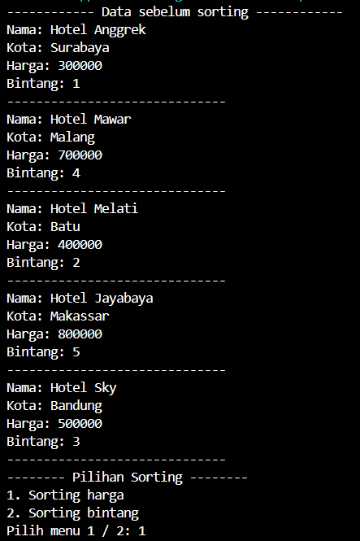

# Laporan Jobsheet Pertemuan 6  
### SORTING(BUBBLE, SELECTION, DAN INSERTION SORT)

Nama    : Diana Rahmawati
Kelas   : TI - 1H
NIM     : 2341720162

### 5.2 Mengurutkan Data Mahasiswa Berdasarkan IPK Menggunakan Bubble Sort

#### 5.2.2 Verifikasi Hasil Percobaan

 

#### 5.2.3 Pertanyaan
1. Terdapat di method apakah proses bubble sort? 
    Jawab: Terdapat pada method bubbleSort()
2. Di dalam method bubbleSort(), terdapat baris program seperti di bawah ini:

Untuk apakah proses tersebut?
    Jawab: Proses ini digunakan untuk melakukan pengecekan nilai IPK pada elemen listMhs[j] dibandingkan dengan nilai IPK elemen sebelumnya listMhs[j-1]. Jika nilai IPK elemen listMhs[j] lebih besar dari listMhs[j-1] maka akan dilakukan swap yang dibantu variabel tmp sebagai penampung.
 
3. Perhatikan perulangan di dalam bubbleSort() di bawah ini:

a. Apakah perbedaan antara kegunaan perulangan i dan perulangan j? 
   Jawab: 
    Perulangan i = digunakan untuk mengulang sepanjang elemen listMhs dikurang 1.
    Perulangan j = digunakan untuk membandingkan elemen indeks j dengan elemen indeks j-i. Pada tahap ini akan terjadi proses swap.  
b. Mengapa syarat dari perulangan i adalah i<listMhs.length-1> ?
   Jawab: Karena i digunakan sebagai patokan tahap sorting yang dimana dilakukan sebanyak - n kali dari jumlah elemen yang ada. Jadi karena i dimulai dari 0 maka jumlah elemen listMhs dikurangi 1 agar menyesuaikan dengan index array.  
c. Mengapa syarat dari perulangan j adalah j<listMhs.length-i> ?
   Jawab: Digunakan untuk memastikan bahwa perulangan tidak mengulang elemen di luar batas array listMhs.
d. Jika banyak data di dalam listMhs adalah 50, maka berapakali perulangan i akan berlangsung? Dan ada berapa Tahap bubble sort yang ditempuh?
   Jawab: Perulangan i akan dilakukan sebanyak 49 kali. 
    Sn = n/2 (2a + (n-1)b)
    Sn = 49/2 (2*1 + (49-1) * 1)
    Sn = 24,5 (2 + 48)
    Sn = 24,5 * 50
    Sn = 1225
   Tahap Bubble Sort akan dilakukan sebanyak 1225 kali.

### 5.3 Mengurutkan Data Mahasiswa Berdasarkan IPK Menggunakan Selection Sort

#### 5.3.2. Verifikasi Hasil Percobaan

 

#### 5.3.3. Pertanyaan
Di dalam method selection sort, terdapat baris program seperti di bawah ini:

Untuk apakah proses tersebut, jelaskan!  
   Jawab: Proses ini digunakan untuk mencari nilai terkecil sebelah kanan dari index i yang kemudian disimpan pada variabel idxMin

### 5.4 Mengurutkan Data Mahasiswa Berdasarkan IPK Menggunakan Insertion Sort

#### 5.4.2 Verifikasi Hasil Percobaan

 

#### 5.4.3 Pertanyaan
Ubahlah fungsi pada InsertionSort sehingga fungsi ini dapat melaksanakan proses sorting dengan cara descending
   Jawab: 
- Fungsi insertSort

- Output

### 5.5 Latihan Praktikum
Buatlah proses sorting data untuk kedua filter harga dan bintang dengan menggunakan algoritma bubble sort dan selection sort.
- Hotel

- HotelService

- Main

- Output

