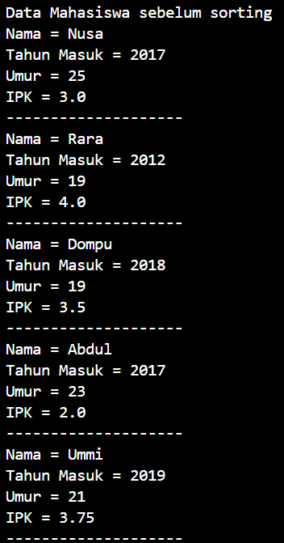

# Laporan Jobsheet Pertemuan 6  
### SORTING(BUBBLE, SELECTION, DAN INSERTION SORT)

Nama    : Diana Rahmawati
Kelas   : TI - 1H
NIM     : 2341720162

### 5.2 Mengurutkan Data Mahasiswa Berdasarkan IPK Menggunakan Bubble Sort

#### 5.2.2 Verifikasi Hasil Percobaan

 

#### 5.2.3 Pertanyaan
1. Terdapat di method apakah proses bubble sort?
    **Jawab:** Terdapat pada method bubbleSort()
2. Di dalam method bubbleSort(), terdapat baris program seperti di bawah ini:
Untuk apakah proses tersebut?
3. Perhatikan perulangan di dalam bubbleSort() di bawah ini:
a. Apakah perbedaan antara kegunaan perulangan i dan perulangan j? 
b. Mengapa syarat dari perulangan i adalah i<listMhs.length-1> ?
c. Mengapa syarat dari perulangan j adalah j<listMhs.length-i> ?
d. Jika banyak data di dalam listMhs adalah 50, maka berapakali perulangan i akan berlangsung? Dan ada berapa Tahap bubble sort yang ditempuh?

### 5.3 Mengurutkan Data Mahasiswa Berdasarkan IPK Menggunakan Selection Sort

#### 5.3.2. Verifikasi Hasil Percobaan

 

#### 5.3.3. Pertanyaan
Di dalam method selection sort, terdapat baris program seperti di bawah ini:
Untuk apakah proses tersebut, jelaskan

### 5.4 Mengurutkan Data Mahasiswa Berdasarkan IPK Menggunakan Insertion Sort

#### 5.4.2 Verifikasi Hasil Percobaan

 

#### 5.4.3 Pertanyaan
Ubahlah fungsi pada InsertionSort sehingga fungsi ini dapat melaksanakan proses sorting 
dengan cara descending

### 5.5 Latihan Praktikum