# Laporan Jobsheet 6
## Searching
<br>
Nama    : Diana Rahmawati<br>
NIM     : 2341720162<br>
Kelas   : TI - 1H

### 6.2. Searching / Pencarian Menggunakan Agoritma Sequential Search
#### 6.2.2 Verifikasi Hasil Percobaan
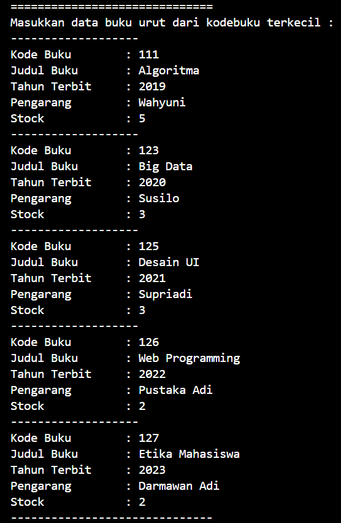
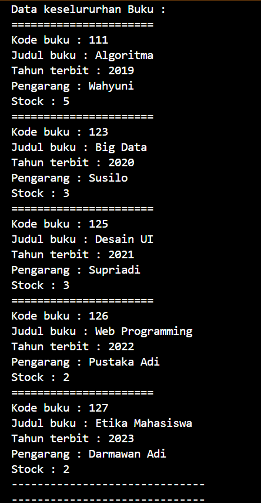
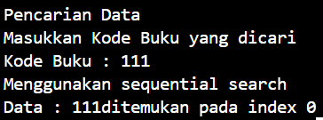

#### 6.2.3 Pertanyaan
1. Jelaskan fungsi break yang ada pada method FindSeqSearch!<br>
**Jawab:** Fungsi break digunakan untuk menghenetikan perulangan jika data yang dicari sudah ditemukan.
2. Jika Data Kode Buku yang dimasukkan tidak terurut dari kecil ke besar. Apakah program masih dapat berjalan? Apakah hasil yang dikeluarkan benar? Tunjukkan hasil screenshoot untuk bukti dengan kode Buku yang acak. Jelaskan Mengapa hal tersebut bisa terjadi?<br>
**Jawab:** Program masih dapat berjalan, karena pada  sequiential search tidak memperhatikan urutan data. Data akan dicek mulai dari index ke-0 hingga index terakhir, jika terdapat data yang sesuai maka data ditemukan.<br>
3. Buat method baru dengan nama FindBuku menggunakan konsep sequential search dengan tipe method dari FindBuku adalah BukuNoAbsen. Sehingga Anda bisa memanggil method tersebut pada class BukuMain seperti gambar berikut <br>
**Jawab:**
- Fungsi
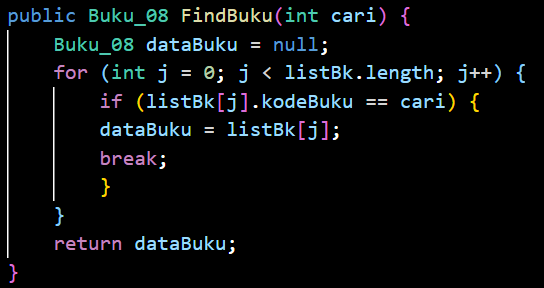<br>
- Output
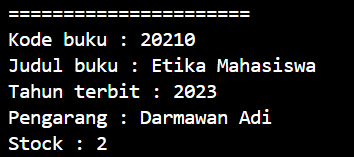<br>


### 6.3. Searching / Pencarian Menggunakan Binary Search
#### 6.3.2 Verifikasi Hasil Percobaan
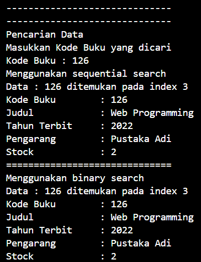

#### 6.3.3 Pertanyaan
1. Tunjukkan pada kode program yang mana proses divide dijalankan!<br>
**Jawab:** 
    ```java
    return FindBinarySearch(cari, left, mid-1); <br>
    return FindBinarySearch(cari, mid + 1, right);
    ```
    <br>
2. Tunjukkan pada kode program yang mana proses conquer dijalankan!<br>
**Jawab:** 
    ```java
    return FindBinarySearch(cari, left, mid-1); <br>
    return FindBinarySearch(cari, mid + 1, right);
    ```
    <br>
3. Jika data Kode Buku yang dimasukkan tidak urut. Apakah program masih dapat berjalan? Mengapa demikian! Tunjukkan hasil screenshoot untuk bukti dengan kode Buku yang acak. Jelaskan Mengapa hal tersebut bisa terjadi? <br>
**Jawab:** Tidak bisa, karena pada algoritma binary search terdapat pengecekan data yang akan dicari apakah berada di sebalah kanan atau kiri. Jika data tidak terurut maka pengecekan tersebut akan menghasilkan pilihan yang kurang valid sehingga bisa saja data ada namun pada pencarian menghasilkan data tidak ditemukan.
<br>
4. Jika Kode Buku yang dimasukkan dari Kode Buku terbesar ke terkecil (missal : 20215, 20214, 20212, 20211, 20210) dan elemen yang dicari adalah 20210. Bagaimana hasil dari binary search? Apakah sesuai? Jika tidak sesuai maka ubahlah kode program binary seach agar hasilnya sesuai!<br>
**Jawab:** 
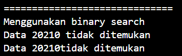 <br>
Outputnya adalah data tidak ditemukan. Untuk mengatasi hal ini maka harus mengubah pengurutan datanya menjadi descending dengan melakukan perubahan pada kode program : <br>
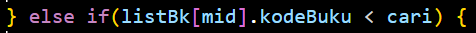
Tanda yang sebelumnya > diganti menjadi tanda < agar dapat mengurutkan data.


### 6.4. Percobaan Pengayaan Divide and Conquer

#### 6.4.2 Verifikasi Hasil Percobaan
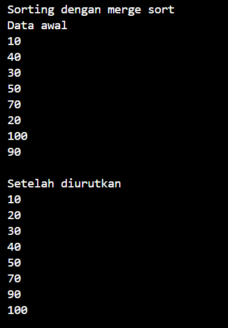

### 6.5 Latihan Praktikum
1. Modifikasi percobaan searching diatas dengan ketentuan berikut ini 
- Ubah tipe data dari kode Buku yang awalnya int menjadi String
- Tambahkan method untuk pencarian kode Buku (bertipe data String) dengan menggunakan sequential search dan binary search.<br>
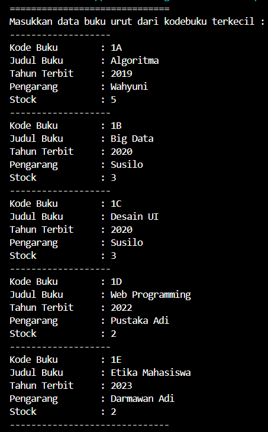 <br>
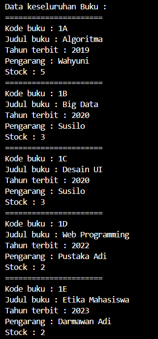 <br>
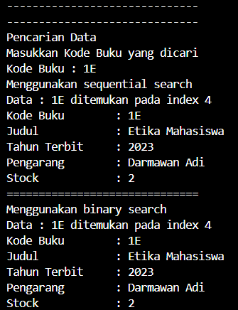 <br>

2. Modifikasi percobaan searching diatas dengan ketentuan berikut ini
- Tambahkan method pencarian judul buku menggunakan sequential search dan binary search. Sebelum dilakukan searching dengan binary search data harus dilakukan pengurutan dengan menggunakan algoritma Sorting (bebas pilih algoritma sorting apapun)! Sehingga ketika input data acak, maka algoritma searching akan tetap berjalan.
- Buat aturan untuk mendeteksi hasil pencarian judul buku yang lebih dari 1 hasil dalam bentuk kalimat peringatan! Pastikan algoritma yang diterapkan sesuai dengan kasus yang diberikan! <br>
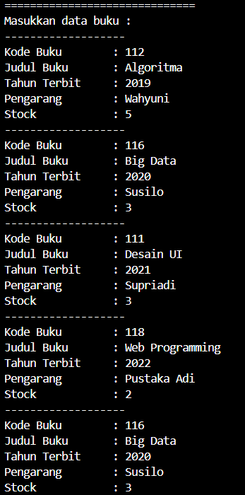 <br>
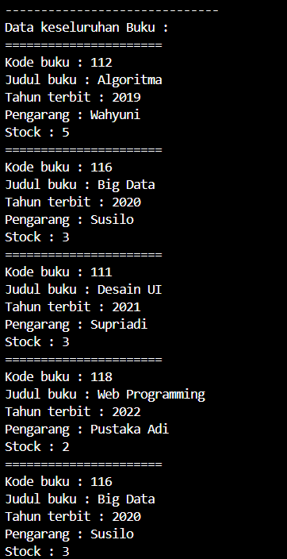 <br>
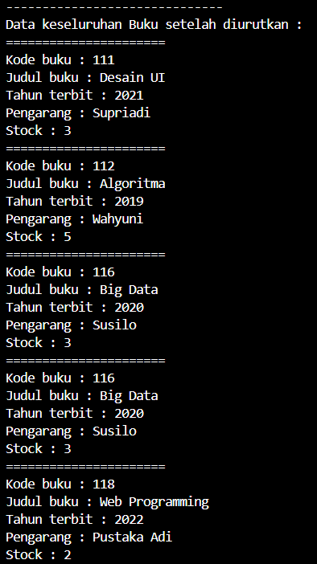 <br>
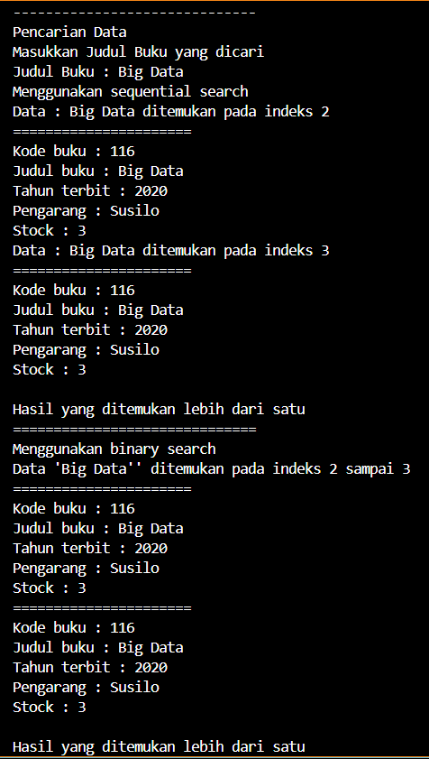 <br>

