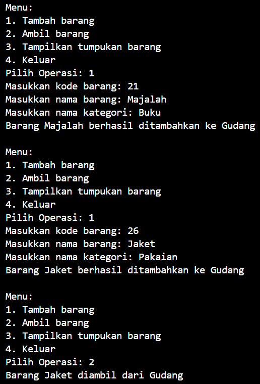
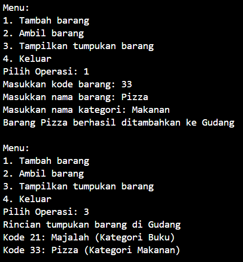
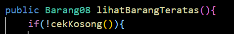
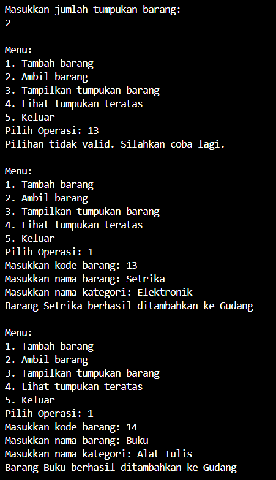
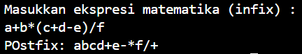

# Laporan Praktikum Pertemuan 8 
## Jobsheet 8 : Stack

Nama    : Diana Rahmawati <br>
Kelas   : TI - 1H <br>
NIM     : 2341720162 <br>

### 2.1 Penyimpanan Tumpukan Brang dalam Gudang
#### 2.1.2 Verifikasi Hasil Percobaan

<br>


#### 2.1.3 Pertanyaan 
1. Lakukan perbaikan pada kode program, sehingga keluaran yang dihasilkan sama dengan verifikasi hasil percobaan! Bagian mana saja yang perlu diperbaiki?<br>
**Jawab:** Bagian yang perlu diperbaiki yaitu pada method lihatBarangTeratas pada kondisi pemilihan if. 
<br>

2. Berapa banyak data barang yang dapat ditampung di dalam tumpukan? Tunjukkan potongan kode programnya!<br>
**Jawab:** Barang yang dapat ditampung yaitu 7,
```java
Gudang08 gudang = new Gudang08(7);
```
3. Mengapa perlu pengecekan kondisi !cekKosong() pada method tampilkanBarang? Kalau kondisi tersebut dihapus, apa dampaknya?<br>
**Jawab:** Pengecekan kondisi !cekKosong berguna untuk memastikan bahwa tumpukan barang tidak kosong sebelum mencoba untuk menampilkan barangnya. Jika tumpukan barang kosong maka tidak ada yang perlu ditampilkan sehingga akan mencetak peringatan bahwa barang kosong.
Jika kondisi tersebut dihapus maka akan menampilkan isi tumpukan barang tanpa pengecekan kosong atau tidaknya tumpukan barang. Dan jika tumpukan barang kosong maka bisa saja terjadi error NullPointerException.<br>
4. Modifikasi kode program pada class Utama sehingga pengguna juga dapat memilih operasi lihat barang teratas, serta dapat secara bebas menentukan kapasitas gudang!<br>

5. Commit dan push kode program ke Github<br>


### 2.2  Konversi Kode Barang ke Biner 
#### 2.2.2 Verifikasi Hasil Percobaan
#### 2.2.3 Pertanyaan

### 2.3 Percobaan 3: Konversi Notasi Infix ke Postfix
#### 2.3.2 Verifikasi Hasil Percobaan


#### 2.3.3 Pertanyaan
1. Pada method derajat, mengapa return value beberapa case bernilai sama? Apabila return value diubah dengan nilai berbeda-beda setiap case-nya, apa yang terjadi?<br>
**Jawab:** Karena beberapa operator matematika tersebut memiliki derajat yang sama. Jika return valuenya diubah dapat menyebabkan hasil konversi ekspresi tidak sesuai dengan konversi ekspresi postfix yang benar, misalnya jika mengubah return value untuk operator '+' dan '-', maka urutan operator tersebut akan berubah sesuai dengan kondisi prioritas yang baru.<br>
2. Jelaskan alur kerja method konversi!<br>
**Jawab:** Method ini digunakan untuk mengubah ekspresi matematika dari bentuk infix menjadi postfix. Variabel p berguna untuk menyimpan ekspresi postfix dan variabel c digunakan untuk menyimpan karakter sementara yang sedang dibaca dari string infix Q. Iterasi setiap karakter melalui string Q, setiap karakter c dalam ekspresi Q diperiksa : 
- jika c merupakan operand, maka c ditambahkan ke string p
- jika c adalah tanda kurung buka '(', maka akan disimpan ke dalam stack method push.
- jika c adalah tanda kurung tutup ')', maka karakter dalam stack akan dipop dan ditambahkan ke dalam string p hingga tanda kurung buka yang kemudian akan dipop keluar dari stack.
- jika c adalah operator, maka akan dilakukan pengecekan prioritas operator. Jika operatornya lebih tinggi dari operator yang berada di stack, maka operator akan dimasukkan ke dalam  stack. Dan jika tidak maka operator yang ada di stack dengan prioritas yag lebih tinggi atau sama akan dipop keluar dan ditambahkan ke dalam string p sampai operator pada stack lebih rendah dari operator c. setelah itu, operator c dimasukkan ke dalam stack menggunakan method push.
Setelah iterasi selesai, dan jika masih ada operator di dalam stack maka akan dipop keluar dan ditambahkan ke dalam string p
3. Pada method konversi, apa fungsi dari potongan kode berikut?<br>
**Jawab:** Ketika dilakukan perulangan sebanyak panjang dari string dikirimkan, fungsi kode tersebut adalah untuk mengambil setiap karakter yang ada pada string Q. Yang kemudian disimpan pada variable c dan akan dilakukan proses konversi.


### 2.4 Latihan Praktikum

